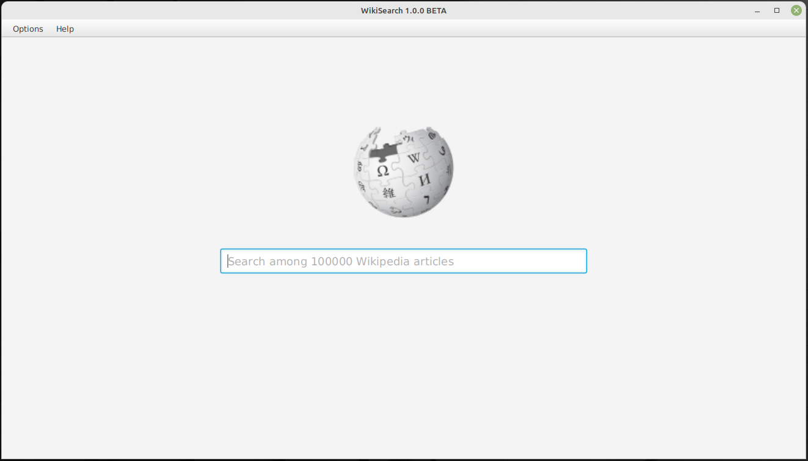
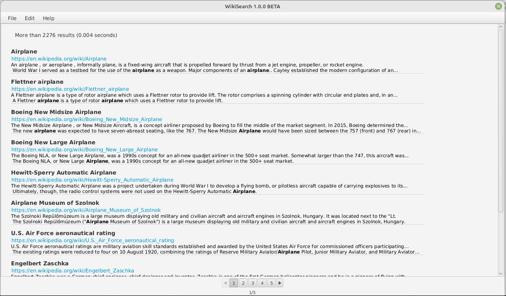
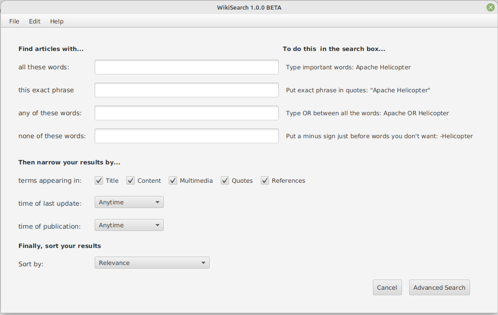
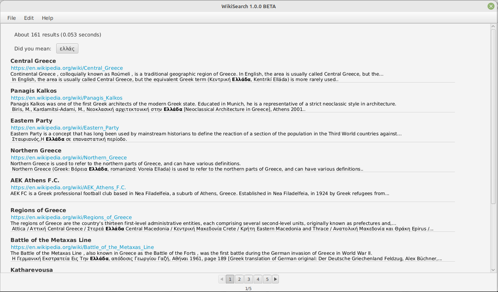
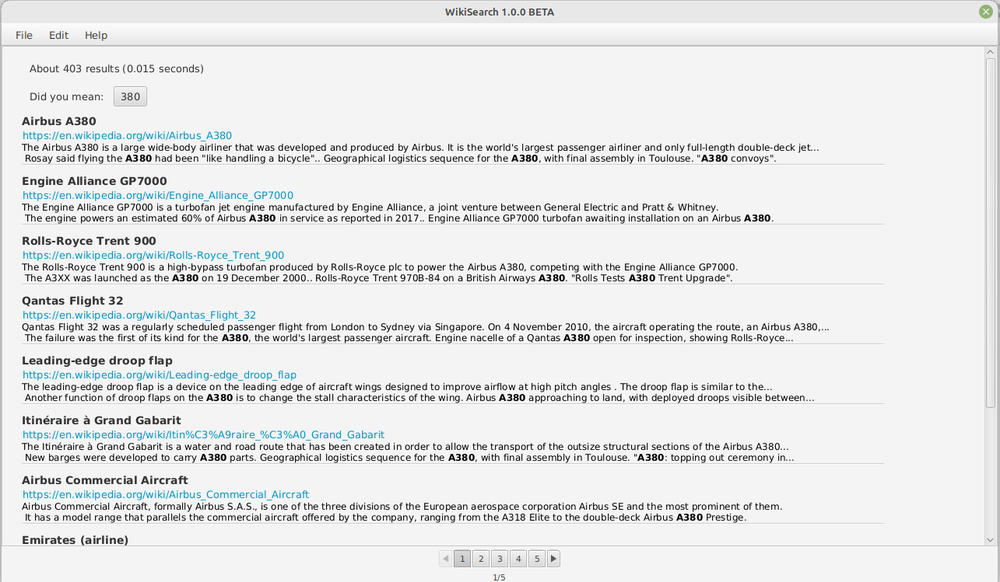
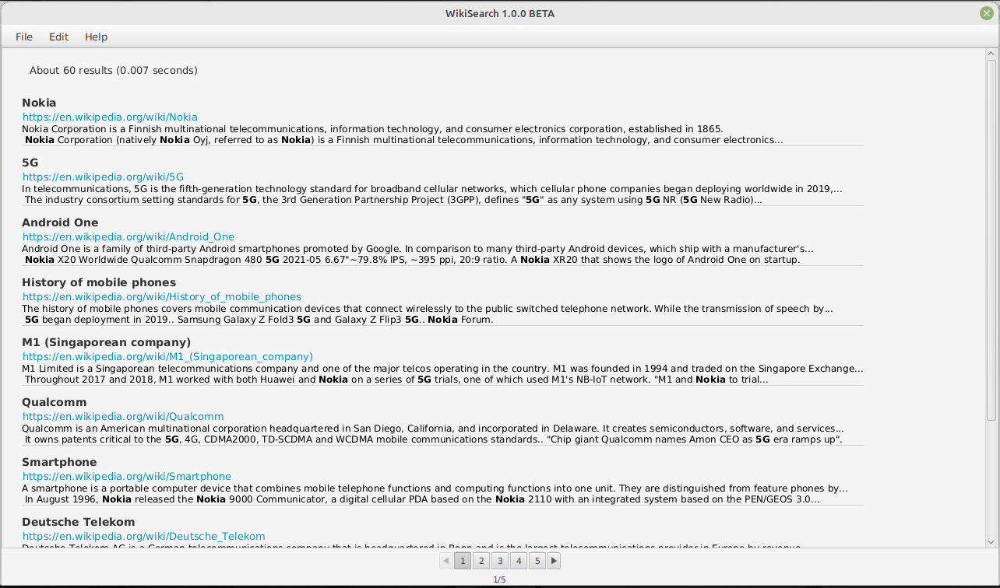
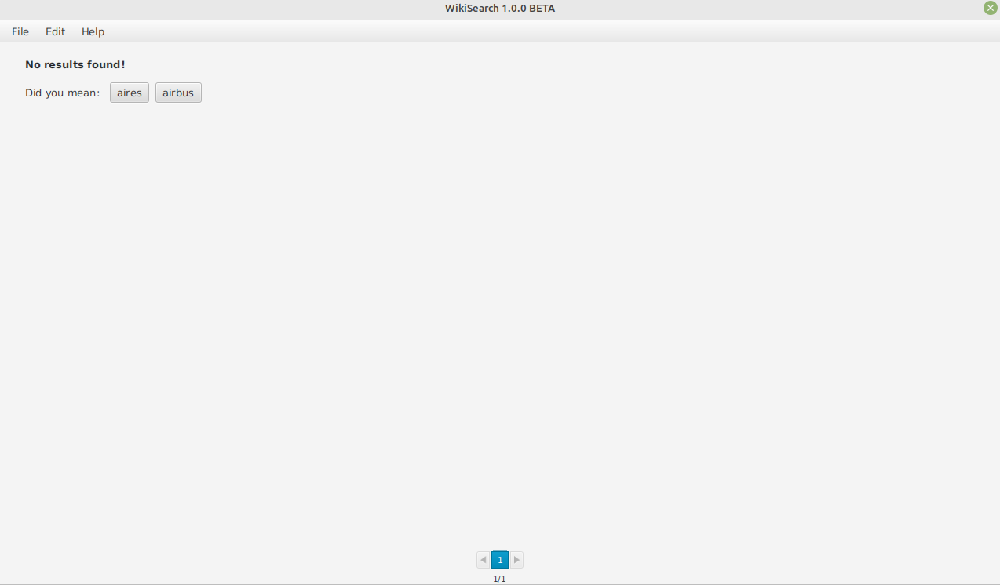
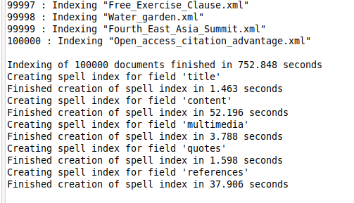

# ir-course-uoi

The project for the Information Retrieval course @[cse.uoi.gr](https://www.cse.uoi.gr)
is about implementing a search engine for [Wikipedia](https://www.wikipedia.org/)
articles using [Apache Lucene](https://lucene.apache.org/).

In [ir-course-uoi-data](https://github.com/gzachos/ir-course-uoi-data), you can find the implementation
of a custom crawler and HTML preprocessor to extract text from the HTML pages scrapped.

This search engine supports multiple features. For example:
  * Keyword/Phrase/Wildcard/Boolean Queries
  * Spelling correction
  * Searching in specific article sections (i.e. Title, Content, Multimedia, Quotes, References)
  * Displaying a short description/summary for each result, including highlighting of search terms
  * Sorting based on Relevance, Publication Date or Modification Date (Ascending/Descending)
  * Narrowing of results based on time of last update or time of publication (Anytime, day, week, 1/3/6/12 months)

# Screenshots

 
 # License
[GNU GENERAL PUBLIC LICENSE Version 2, June 1991](LICENSE)

For the license statements of 3rd party software, please refer to [lucene-8.5.1](lucene-8.5.1)
and [javafx-sdk-11.0.2](javafx-sdk-11.0.2).

